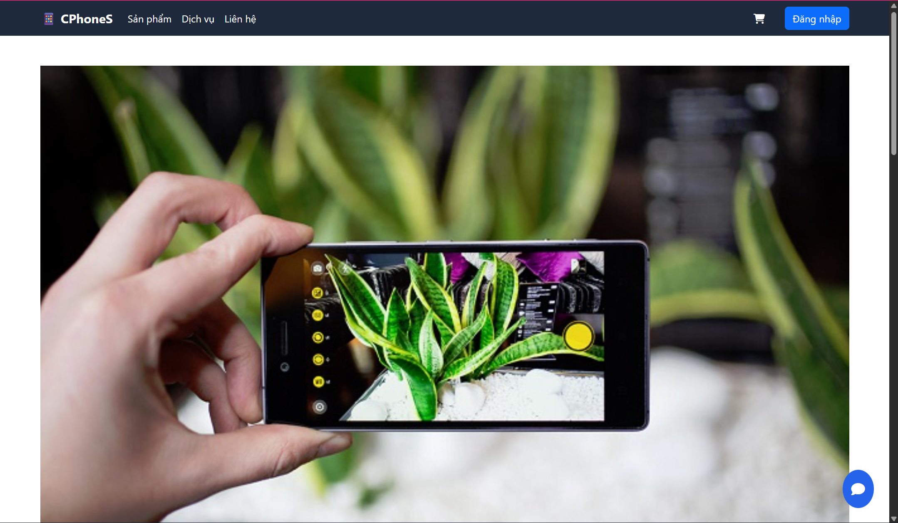
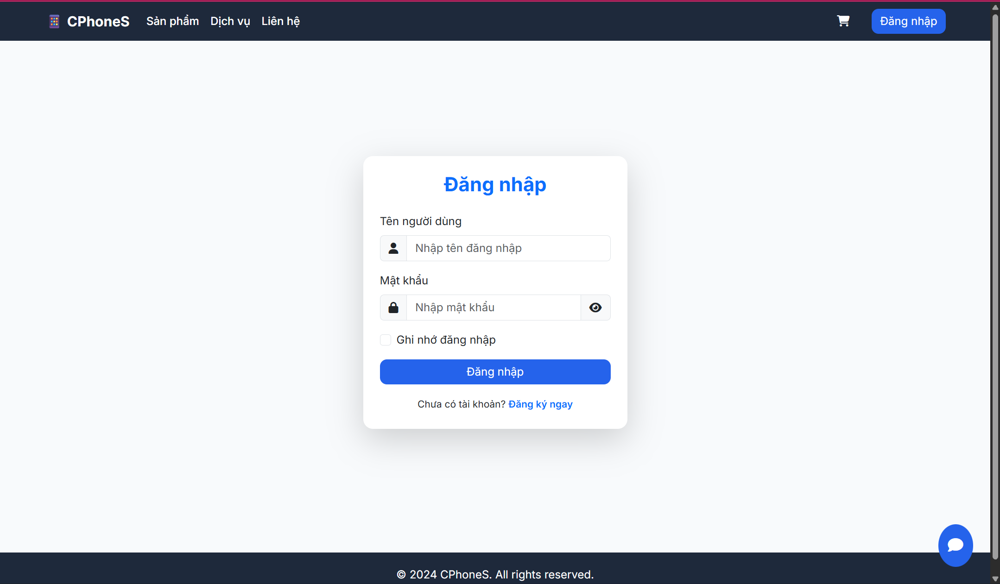
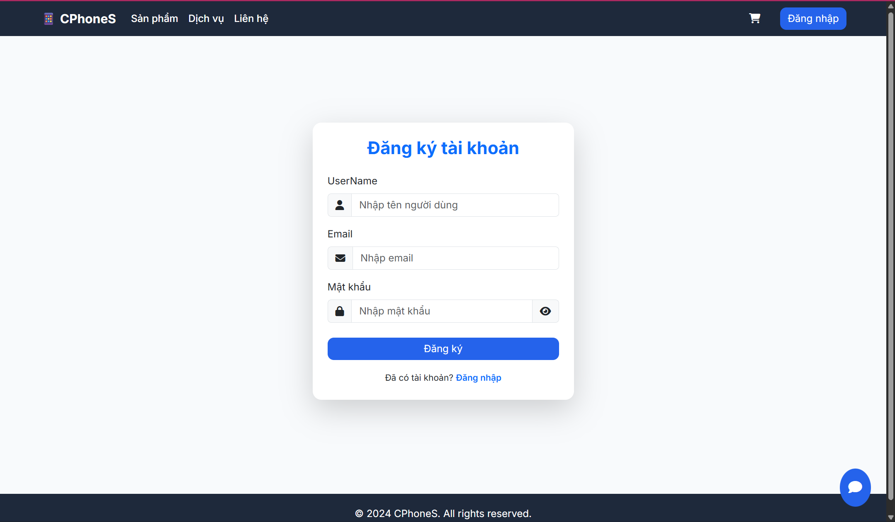
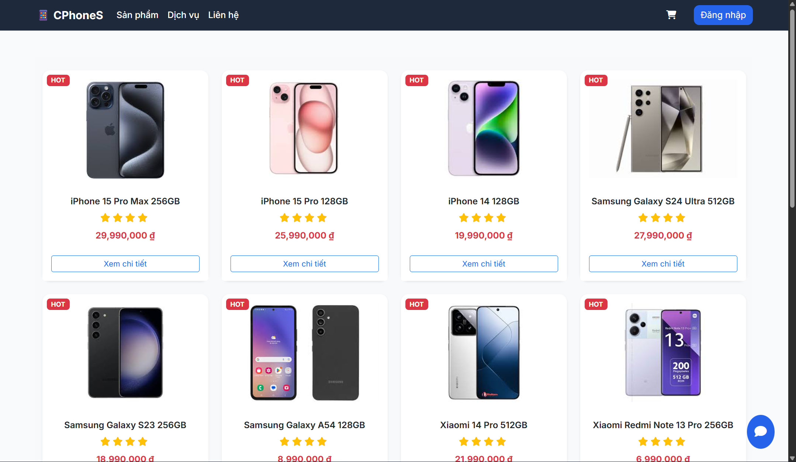
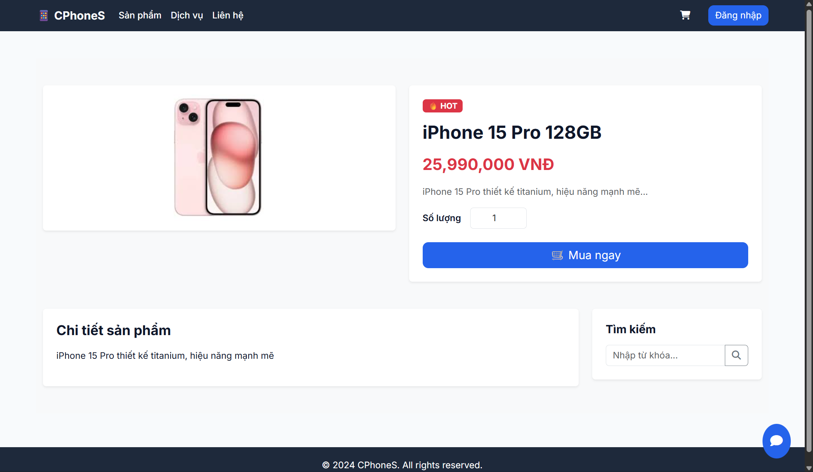
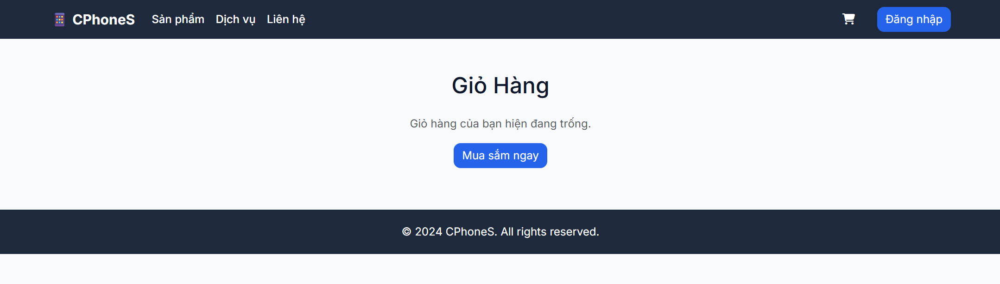
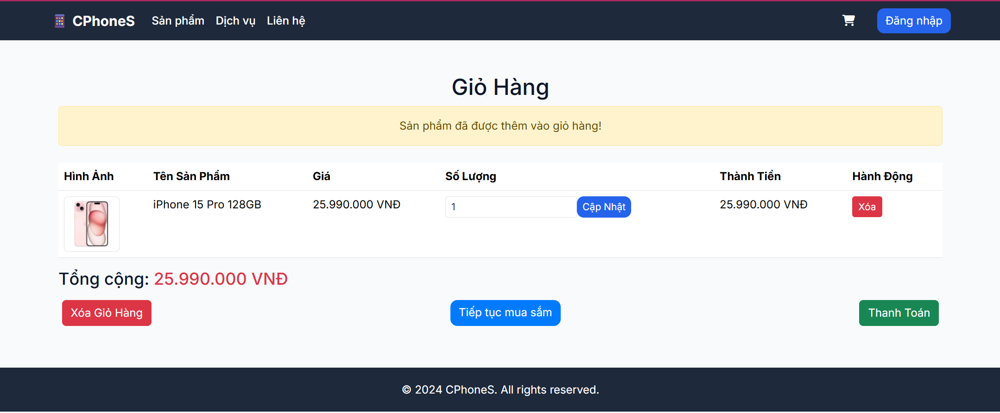
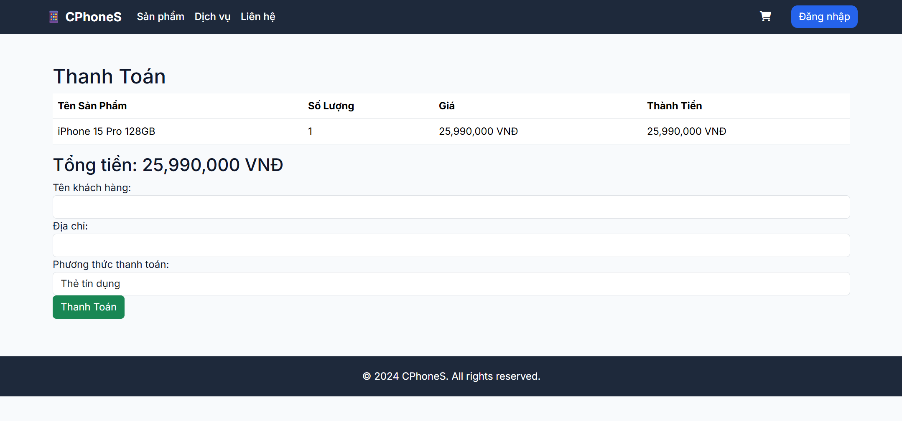

# CellPhoneS - Phone E-Commerce Website

**Short description**
Server-side rendered e-commerce website for mobile phone sales built with ASP.NET Core MVC.
Features user authentication, shopping cart, order management, admin product management, modern UI, and Google Maps integration for store location.

Repository: https://github.com/khanh-design/CellPhoneS.git

## Demo / Screenshots

  <h3>1. User Screens</h3>

  <table>
    <tr>
      <td align="center">
         
        Homepage
      </td>
      <td align="center">
         
        Login
      </td>
      <td align="center">
         
        Register
      </td>
      <td align="center">
         
        Product List
      </td>
    </tr>
    <tr>
      <td align="center">
         
        Product Detail
      </td>
      <td align="center">
         
        Cart
      </td>
      <td align="center">
         
        Order
      </td>
      <td align="center">
         
        Order History
      </td>
    </tr>
  </table>

## Features

- Server-side rendered UI using ASP.NET Core MVC + Razor Views
- User authentication (Login / Register / Logout)
- Session-based shopping cart
- Order placement and order history
- Admin management:
  + Products
  + Categories
  + Orders
- Product detail page with image gallery
- Google Maps integration for store location
- Modern responsive UI using Bootstrap 5

## Tech Stack
- ASP.NET Core MVC
- C#
- Entity Framework Core
- SQL Server
- Razor View Engine
- Bootstrap 5
- HTML / CSS / JavaScript

## Prerequisites
- .NET SDK 6.0+ (or version bạn đang dùng)
- SQL Server
- Git
- IDE: Visual Studio 2022 / Rider / VS Code